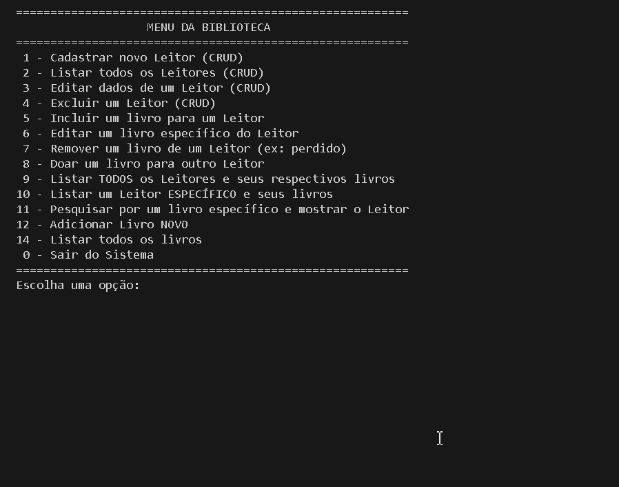

# Sistema de Cadastro Biblioteca

- Sistema conta com CRUD de Leitores e Livros

- E possivel rastrear os Livros pelos Leitores e vice-versa

- E Possivel adicionar, remover ou doar livros dos leitores

## Programa feito Utilizando Objetos de Livros e Leitores

### Feito em metodos separados do arquivo MAIN.

- **NECESSARIO _DOTNET_ PARA O FUNCIONAMENTO DO ARQUIVO**

# Melhorias a serem feitas:

- Atualmente o codigo nao conta com tratamento de Exceçoes se acaso o usuario digitar um input de um tipo nao esperado o programa da crash.